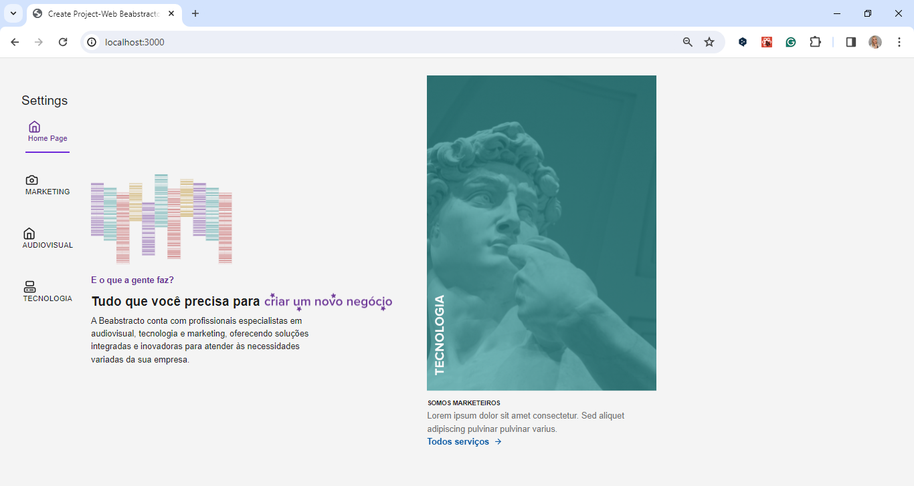

<h1 align="center"> 💻 Web_project - TailwindCSS and Next.js</h1>

------

## Documentation # Tailwindcss And  Nextjs

For full documentation, visit [tailwindcss.com](https://tailwindcss.com/).

For full documentation, visit [nextjs](https://nextjs.org/docs/).

------

### About

Web page project with the following technologies: Tailwind CSS and Next.js.

## Technologies Used

- **Next.js**: React framework for production that makes it easy to build web applications and static sites.
- **Tailwind CSS**: Utility-first CSS framework for creating customized designs without leaving your HTML.

- **React**: A JavaScript library for building user interfaces.
- **Radix UI**: A library of low-level components for building accessible, high-quality user interfaces.
- **ESLint**: A static code analysis tool for identifying problematic patterns found in JavaScript code.
- **Lucide React**: A React implementation of the Lucide library, offering scalable icons as SVG components.

- ### Additional Tools
  
- **transform.tools**: Used to transform pictures into .svg compatible with Tailwind CSS.
- **Netlify**: Deployment platform chosen to host the project.

<h2 align="center"> 💻 Project</h2>

 

-------

## 🔖 Project on air
You can visualize the project on air [link](  https://beabstracto.netlify.app/)

## 🔖 Git Clone
You can visualize the project [link]( https://github.com/ludiemert/Project_Beabstracto.git )

---

#### Contact

#### [**Luciana Diemert**](https://github.com/ludiemert)

🛠 `Front-end` `Back-end`Developer Jr.  
📍 São Jose dos Campos – SP - Brazil

&nbsp;
&nbsp;
&nbsp;
&nbsp;

 

